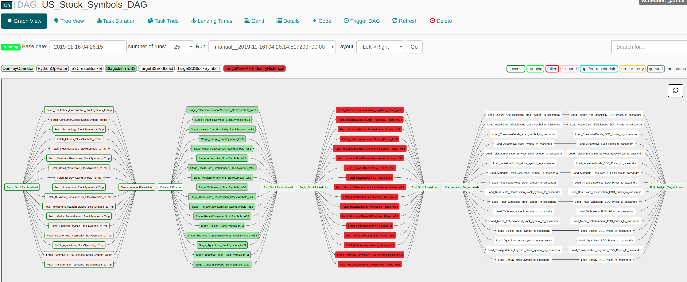
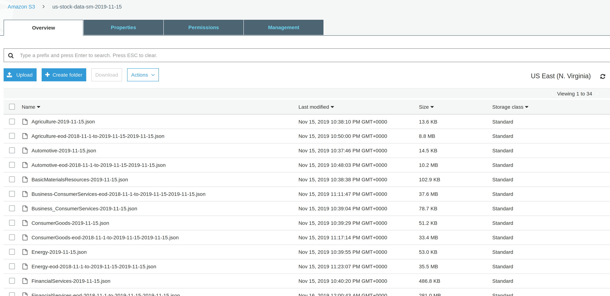
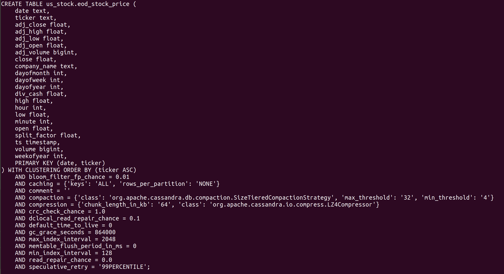
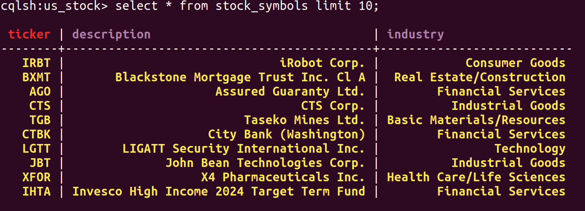

# Airflow-Pipeline US Stock Prices (using apache spark & apache cassandra): *Industry Wide*
Scraping stock symbols for daily prices look ups (suprisingly difficult to get stock symbols in a master list fashion).  This data is then staged in S3 and fed into Apache Cassandra.
This data pipeline focuses on US stock by industry, stock symbols, stock prices and some basic aggregations to illustrate the use case of various technologies. The high level steps; getting a complete listing of US stock by industry, writing to an S3 bucket, processing via Apache Spark and eventually writing to an analytical layer in an Apache Cassandra standalone instance.  All this in the absense of !yahoo finance which no longer exists!

## Overall 'the what' of this data pipeline
Take some data from the web via scraping, use this as a basis to query a web API and gather historical data (though can be used for an ongoing daily batch) and:
1. Write locally the data as json or avro files.
2. Create AWS S3 bucket for that particular execution date
3. Update various data into AWS S3 bucket
4. Aggregate and transform data using Apache Spark, reading directly from the S3 bucket
5. Update data into Apache Cassandra

A nice **overview** diagram can be summed up by the DAG itself in airflow in its graphical view.  This shows the overall data pipeline flow and the various stages of the dag, namely; *web scrape read* **->** *web API read* **->** *write to S3* **->** *stock symbols & EOD prices* **->** *write to cassandra*:



Apache Airflow was used with a number of custom operators which extend the base functionality.  These include the following in the code listings within this repo and which reside in the *plugins* directory:
* **StageJsonToS3** - writes files to S3 given a bucket and key reference. 
* **S3CreateBucket** - creates S3 bucket if it does not exist, in this case an execution date is appended onto the bucket. 
* **TiingoPricePerIndustryHistorical** - This runs the API call to Tiingo for stock prices, and inherits from a common API parent.  
* **TargetS3StockSymbols** - This uses the spark engine to read the staged S3 data and write the tock symbol master data to a standalone Apache Cassandra instance, this inherits from a common parent which initialises various connections. 
* **TargetS3EodLoad** - This uses the spark engine to read stock price data, run some aggregations and joins and write to the same Cassandra instance. 

A helper class was employed to manage the various stock **industries** in one location.  From here a python dictionary was used to manage file names, paths and labels as per the code listing:
```
class StockSymbols(object):

	def __init__(self):
		# Read config file
		with open("plugins/helpers/config.json", "r") as f:
		    self.config = json.load(f)

		self.ALL_STOCK_SYMBOLS_URL = self.config['USTOCK']['url']
		self.FILE_TO_WRITE = self.config['OUTPUT']
		
		self.US_STOCK_INDUSTRY_CODES = {
		    "Agriculture": {"code": "WSJMXUSAGRI", 
		    				"filename": self.FILE_TO_WRITE.format("Agriculture".replace("/", "_")), 
		    				"s3_key_stock_symbols": 'Agriculture-{}.json',
		    				"s3_key_eod": "Agriculture-eod-{start}-to-{end}-{ds}.json"},
		    "Automotive": {"code": "WSJMXUSAUTO", 
		    			   "filename": self.FILE_TO_WRITE.format("Automotive".replace("/", "_")), 
		    			   's3_key_stock_symbols': 'Automotive-{}.json',
		    			   "s3_key_eod": "Automotive-eod-{start}-to-{end}-{ds}.json"},
		    "Basic Materials/Resources": {"code": "WSJMXUSBSC", 
		    						      "filename": self.FILE_TO_WRITE.format("Basic Materials/Resources".replace("/", "_")), 
		    						      's3_key_stock_symbols': 'BasicMaterialsResources-{}.json',
		    						      "s3_key_eod": "Materials-Resources-eod-{start}-to-{end}-{ds}.json"},
		    "Business/Consumer Services": {"code": "WSJMXUSCYC", 
		    							   "filename": self.FILE_TO_WRITE.format("Business/Consumer Services".replace("/", "_")), 
		    							   "s3_key_stock_symbols": 'Business_ConsumerServices-{}.json',
		    							   "s3_key_eod": "Business-ConsumerServices-eod-{start}-to-{end}-{ds}.json" },
		    "Consumer Goods": {"code": "WSJMXUSNCY", 
		    				   "filename": self.FILE_TO_WRITE.format("Consumer Goods".replace("/", "_")), 
		    				   "s3_key_stock_symbols": 'ConsumerGoods-{}.json',
		    				   "s3_key_eod": "ConsumerGoods-eod-{start}-to-{end}-{ds}.json"},
		    "Energy": {"code": "WSJMXUSENE", 
		    		   "filename": self.FILE_TO_WRITE.format("Energy".replace("/", "_")), 
		    		   's3_key_stock_symbols': 'Energy-{}.json',
		    		   "s3_key_eod": "Energy-eod-{start}-to-{end}-{ds}.json"},
		    "Financial Services": {"code": "WSJMXUSFCL", 
		    					   "filename": self.FILE_TO_WRITE.format("Financial Services".replace("/", "_")), 
		    					   's3_key_stock_symbols': 'FinancialServices-{}.json',
		    					   "s3_key_eod": "FinancialServices-eod-{start}-to-{end}-{ds}.json"},
		    "Health Care/Life Sciences": {"code": "WSJMXUSHCR", 
		                                  "filename": self.FILE_TO_WRITE.format("Health Care/Life Sciences".replace("/", "_")), 
		                                  's3_key_stock_symbols': 'HealthCare-LifeSciences-{}.json',
		                                  "s3_key_eod": "HealthCare-LifeSciences-eod-{start}-to-{end}-{ds}.json"},
		    "Industrial Goods": {"code": "WSJMXUSIDU", 
		    					 "filename": self.FILE_TO_WRITE.format("Industrial Goods".replace("/", "_")), 
		    					 's3_key_stock_symbols': 'IndustrialGoods-{}.json',
		    					 "s3_key_eod": "IndustrialGoods-eod-{start}-to-{end}-{ds}.json"},
		    "Leisure/Arts/Hospitality": {"code": "WSJMXUSLEAH", 
		    							 "filename": self.FILE_TO_WRITE.format("Leisure/Arts/Hospitality".replace("/", "_")), 
		    							 's3_key_stock_symbols': 'Leisure-Arts-Hospitality-{}.json',
		    							 "s3_key_eod": "Leisure-Arts-Hospitality-eod-{start}-to-{end}-{ds}.json"},
		    "Media/Entertainment": {"code": "WSJMXUSMENT", 
		    						"filename": self.FILE_TO_WRITE.format("Media/Entertainment".replace("/", "_")), 
		    						's3_key_stock_symbols': 'MediaEntertainment-{}.json',
		    						"s3_key_eod": "Media-Entertainment-eod-{start}-to-{end}-{ds}.json"},
		    "Real Estate/Construction": {"code": "WSJMXUSRECN", 
		     							 "filename": self.FILE_TO_WRITE.format("Real Estate/Construction".replace("/", "_")), 
		     							 's3_key_stock_symbols': 'RealEstate-Construction-{}.json',
		     							 "s3_key_eod": "RealEstate-Construction-eod-{start}-to-{end}-{ds}.json"},
		    "Retail/Wholesale": {"code": "WSJMXUSRTWS", 
		    					 "filename": self.FILE_TO_WRITE.format("Retail/Wholesale".replace("/", "_")), 
		    					 's3_key_stock_symbols': 'RetailWholesale-{}.json',
		    					 "s3_key_eod": "Retail-Wholesale-eod-{start}-to-{end}-{ds}.json"},
		    "Technology": {"code": "WSJMXUSTEC", 
		    			   "filename": self.FILE_TO_WRITE.format("Technology".replace("/", "_")), 
		    			   's3_key_stock_symbols': 'Technology-{}.json',
		    			   "s3_key_eod": "Technology-eod-{start}-to-{end}-{ds}.json"},
		    "Telecommunication Services": {"code": "WSJMXUSTEL", 
		                                   "filename": self.FILE_TO_WRITE.format("Telecommunication Services".replace("/", "_")), 
		                                   's3_key_stock_symbols': 'TelecommunicationServices-{}.json',
		                                   "s3_key_eod": "TelecommunicationServices-eod-{start}-to-{end}-{ds}.json"},
		    "Transportation/Logistics": {"code": "WSJMXUSTRSH", 
		    							 "filename": self.FILE_TO_WRITE.format("Transportation/Logistics".replace("/", "_")), 
		    							 's3_key_stock_symbols': 'TransportationLogistics-{}.json',
		    							 "s3_key_eod": "Transportation-Logistics-eod-{start}-to-{end}-{ds}.json"},
		    "Utilities": {"code": "WSJMXUSUTI", 
		    			  "filename": self.FILE_TO_WRITE.format("Utilities".replace("/", "_")), 
		    			  's3_key_stock_symbols': 'Utilities-{}.json',
		    			  "s3_key_eod": "Utilities-eod-{start}-to-{end}-{ds}.json"}
		    }
```
**API reader** - the Tiingo API operator mentioned above called the API per stock symbol, per industry.  It's execute function would process the API call and write to an S3 bucket, passing the date (from and to) parameters to the API along with the frequency of the ticker feed (daily in my case):
```
	def execute(self, context):
		logging.info(f'Commencing fetch of ticker data for {self.industry} industry')

		entries_written = 0
		with open(self.file_to_write, 'w') as f:
			logging.info(f'Opening file for output -> {self.file_to_write}')
			with JSONArrayWriter(f) as jstream:
				for ticker in self.stock_symbols:
					ticker_sym = ticker['symbol_code']
					per_file_recs = 0
					url = self.ENDPOINT.format(ticker=ticker_sym, 
											   start_date=self.h_start_date, 
											   end_date=self.h_end_date, 
											   api_key=self.api_key, 
											   frequency=self.frequency)
					logging.info(f'url api -> {url}')
					content = self.fetch_api(url)
					if content:
						logging.info(f'Writing to stream content for {ticker}')
						for entry in content:
							entry['ticker'] = ticker_sym
							jstream.write(entry)
							per_file_recs += 1
						logging.info(f'Written {per_file_recs} records for ticker {ticker_sym}')
						entries_written += per_file_recs
				logging.info(f'Write completed, total written {entries_written} records')
		logging.info(f'Writing to S3 bucket {self.s3_bucket}')
		self.write_to_s3()


	def write_to_s3(self):
		bucket_to_write = f'{self.s3_bucket}-{self.execution_date}'
		s3_key_to_write = self.s3_key.format(start=self.h_start_date, end=self.h_end_date, ds=self.execution_date)

		if self.s3_hook.check_for_bucket(bucket_to_write):
			self.s3_hook.load_file(filename=self.file_to_write, 
								   key=s3_key_to_write, 
								   bucket_name=bucket_to_write)
			logging.info(f'File {s3_key_to_write} written to s3 bucket {bucket_to_write}')
```


## Scope & Data
Data was sourced from two sources:
1. For stock symbols by industry (complete listing hopefully) the website: http://bigcharts.marketwatch.com
2. For stock prices based on (1) the API reference https://api.tiingo.com/ (Tiingo).  This seemed a complete and easy tp use API with a very cheap pricing plan.  Since I wanted a fair amount of data, I did not want to be limited to 500 calls per day on a free tier, at the same time I did not want to pay a lot for access to quality data.  Tiingo found the middle ground for me in that respect.

The scope of the data would include all US stock, this I got by scraping (1) bigcharts.marketwatch.com.  They had a well laid out website, by industry and fairly easily navigable.  This allowed me to use regular expressions and knowledge of the paging on consecutive pages and *flick through* the US stock by industry listing and write to a local json file.  This formed the basis of the query for the API call, so the process was, get stock symbols (tickers) from web scrape, and run these through the finance API from Tiingo to get a nice historical time series data set.

The below shows the basic web scraper, which takes a industry sector code (of the form **WSJMXUSAGRI** for agriculture for example) and returns rows written and filen name written:

```	
	def write_stock_symbols_for_industry(self, industry):
		"""
		Webscrape for stock symbols from: http://bigcharts.marketwatch.com
		"""

		industry_code = self.US_STOCK_INDUSTRY_CODES[industry]['code']
		matcher = re.compile(r'{}'.format(self.config['USTOCK']['pattern']))

		industry_file = self.US_STOCK_INDUSTRY_CODES[industry]['filename']
		with open(industry_file, 'w') as f:

		    logging.info(f'Opened file {industry}')
		    page = 0
		    symbols_written = 0
		    data = []
		    while True:
		        url = self.ALL_STOCK_SYMBOLS_URL.format(code=industry_code, page=page)
		        url_open = req.urlopen(url)
		        url_bytes = url_open.read()
		        url_str = url_bytes.decode('utf8')
		        url_open.close()
		        logging.info(f'url {url} read ...')

		        results = matcher.findall(url_str)
		        if not results:
		            break
		        logging.info(f'matched {len(results)} results')

		        for match in results:
		            code_st = match.find(">")+1
		            code_ed = match.find("</td>")
		            symbol_code = match[code_st:code_ed]
		            desc_st = match.find("<div>")+5
		            desc_ed = match.find("</div>")
		            desc = match[desc_st:desc_ed]
		            data.append({"symbol_code": symbol_code, 
		            		     "company_name": desc,
		            		     "industry": industry})
		            symbols_written += 1   
		        page += 50
		    json.dump(data, f)  
		    logging.info(f'Symbols written {symbols_written} to {industry_file}')
		
		return industry_file, symbols_written
```
Writing to a local machine tmp directory, the output would be ready to upload into an S3 bucket.  The picture shows a log line generated and written to the airflow job log per API call:


The S3 bucket contained all the source files, staged for further use in vairou ways, in this instance onward to Cassandra for analysis:


## Exploration of Data
The data is fairly well formed coming from an API.  Some old ticker symbols may not return data but are still returned from the webscrape, these just return an error in the log but it is useful to see when and in which industry companies are falling on or off the stock market radar.  This pipeline shows an historic load, but can be run **daily** in batch mode also, in fact it is designed to do just that.  For the historical load I defined variables in airflow, but if it was to run in daily batch mode a shcedule interval could be set up using the DAG properties.

The data set for the year across all US stock/industry returns approximately 2-3m rows of data. A simple flow of a single industry of stocks would look like thisin airflow:


## Data Model Definition
The data model I created in fairly simple and meets the need of analytical reporting.  The S3 staging allows ML models and data analysis to be carried out also, bu primarily the cassandra instance is used to store the data and farm it out at different aggregations, combining different datasets for end user analysis.  An example of the model definition is below in two tables, **stock symbols** and **end of day prices** (Which combines stock symbol data).  EOD prices has been enhanced using spark transforms with various extra information around dates/times (month of year, week of year etc):




## Apache Airflow Configuration details
The airflow configuration is split into stock symbol and end of day price loads, with the stock symbols being the basis for the end of day price feed, hence predecessors in the DAG.
A data quality check ensures all files arew written to a tmp directory from the source before propogating the data further in the data flow:


with the following output:


## Wrap-up
The result was a well strctured stock symbols table, ready to act as a sort of master data in Cassandra for analysis:


And also finally in terms of the data for end of day prices, using CQL in the shell did not work since the data set was quite large, so I had to use the pyspark shell to run the query and confirm what airflow was telling me, that all the records had loaded into Cassandra:


A few questions to answer ...
**What if** the data were expanded and increased 100 times or by 100, what happens?  Since I ran most of the work load on my local machine in standalone spark mode and cassandra instance, performance was definitley an issue, especially reading large files back and forth from AWS S3.  But ideally with scale and increased throughput I a good size cluster for spark and cassandra would be ideal, with the spark cluster having a sound data processing design, incorporating a good knowledge of the data to help limit shuffling.  I actually found that incrasing the memory parameter of the spark driver helped to process the data, as one of the larger loads (**Load_FinancialServices_EOD_Prices_to_cassandra**) was giving a Java Heap memory error.  I thus increased the driver-memory and used the full cores on my laptop and it finished processing the whole data set.  


**What if** the pipeline would need to be run on a dialy basis (say 7am)?  This is pretty simple since scheduling is a minor issue for Airflow, we would just have to bear in mind the execution date and how this would play into the staging of the S3 data which has a date stamped naming convention for buckets.


**What if** the database needed to be accessed by 100+ people?  Since the number is not huge, again this shoud not be a problem, potentially as more users come on board the more query views (per query aggregation or per user group) could be defined to manage the different needs and loads.

## Thanks to ...
Big thanks to **lysdexia** from whom I took and modified a basic stream writer for JSON list (JSONArrayWriter in Tiingo operator)
https://github.com/lysdexia/python-json-stream-writer
